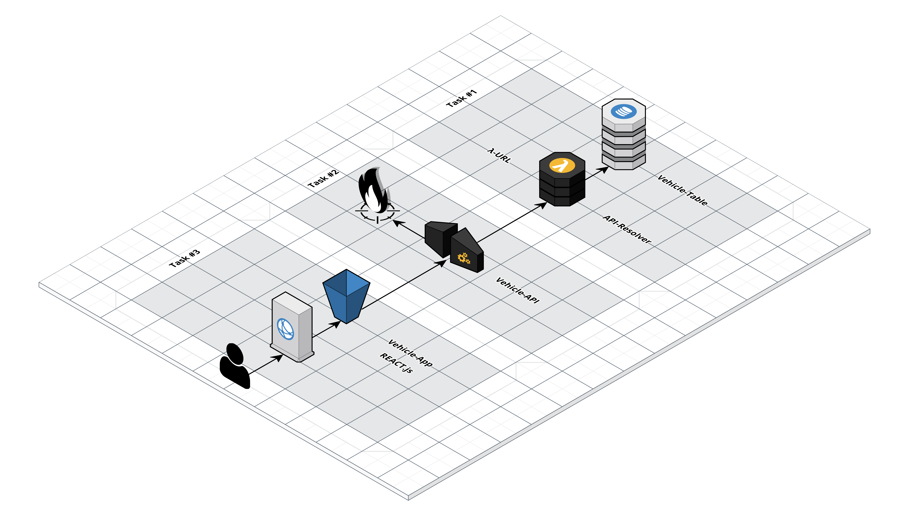

# Vehicle-API

## Introduction

The Repository serves as a Blueprint for Serverless-/REST-APIs on AWS.

## Architecture

<p align="center">
  
</p>

## Prerequisites

- Python => 3.11.x
- Poetry

## OpenAPI

Specification can be found [here](./openapi.yml).

## Infra

### AWS-CDK

TODO => CDK Stuff => Task #1, #2, #3

#### API Gateway

The API Gateway itself is deployed based on our OpenAPI-Specification.

#### WAF

A WAF (Web Application Firewall) could be defined with:
- Custom Rule-Sets
- AWS Rule-Sets

#### λ-Service

The API is 100% serverless-based / served by λ-Service and so is very cost-effective.

#### R53 / ACM

TODO => Optionally

## App

The Application heavily uses [AWS λ-PowerTools for Python](https://docs.powertools.aws.dev/lambda/python/latest/).

This way we avoid lots of DRY-Code + have access to lots of Middleware and Utilities.

Structure is as follows:
```
./vehicle_api:
  • api_resolver.py # Main Controller-Object for all HTTP-/REST-Endpoints
  • mapper.py       # Mapper between Entities/DTOs and vice versa
  • models.py       # Models => all Input-/Output-Objects for API
  • dynamo.py       # Repository-/Persistence-Layer
```

Every Endpoint is served by only one λ-Function. This has various **ADVANTAGES**:

- Chance     of a cold start is heavily reduced
- Complexity of API is very low

### Dependencies

The Application uses some additional Dependencies:

```
• aws-lambda-powertools => (Ships Pydantic for data-validation)
• aws-sdk (boto3)
```

#### λ-Layers

```
• arn:aws:lambda:<REGION>:017000801446:layer:AWSLambdaPowertoolsPythonV2-Arm64:<VERSION>
```

Why ARM64? The API-Resolver is based on Graviton2. Improves Price-Performance even more.

Docs for Installation can be found [here](https://docs.powertools.aws.dev/lambda/python/latest/#install).

## Installation

```
poetry install
```

## Pytest

### Unit-Tests

```
poetry run pytest tests/unit
```

### Intr-Tests

Prerequisite: `docker run -d -p 8000:8000 dynamodb-local:latest`

```
poetry run pytest tests/intr
```

## CICD-Pipeline

TODO

## Envs

TODO
